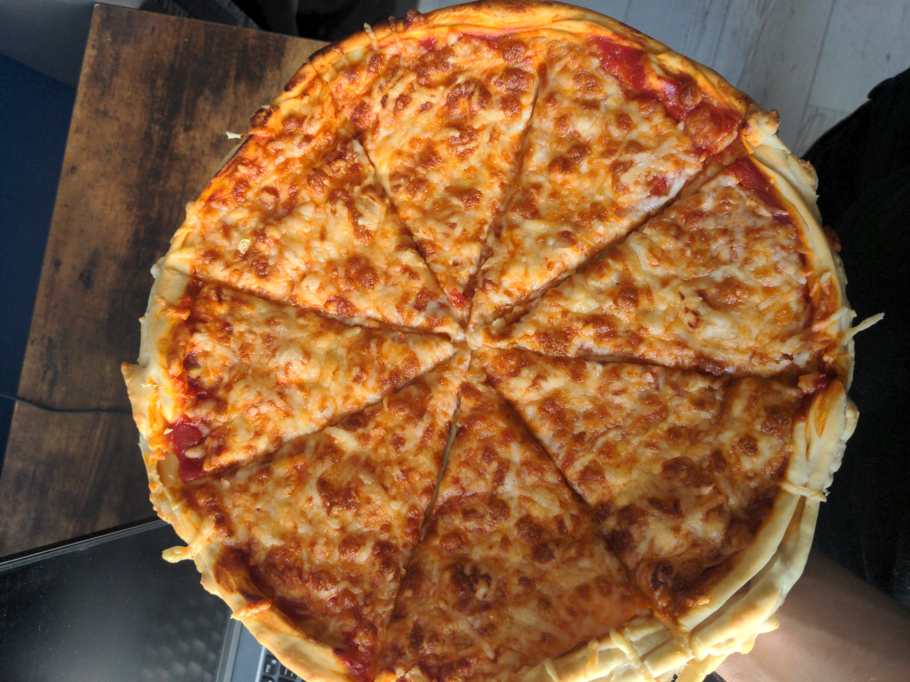

# Report 10/10/2025

Another report time. So I have solved some of the stuff that has been going in my head for a couple of days, maybe even months, and I think it's high time for me to clarify what's next. But first let's point out what was not giving me a rest.

- ***zkProofs, zkVM, zkComputing, zkSNARKs (Cryptrography)*** - For some pretty long time I have been wondering how I can prove any computation without revealing its initial inputs. And I think I have finally solved this issue by creating zk system based on Pedersen commitments and proofs associated with them. To understand how computation of for example, `a * b` or `hash(x)` I needed to learn about what kind of proofs I can provide, and what they can actually prove. Eventually, I have made a repo on GitHub that has all the necessary procedures required for performing safe computation on Pedersen Commitments. Sure, this kind of system produces quite heavy proofs, but I think I can safely sleep now, knowing that if one day zkSNARKs will turn out to be lost, forgotten or worse, cracked, I will be able to produce my alternative approach to solve certain issues.
- ***Homosexuality or Bisexuality*** - Woo yeah, this one was the toughest one in terms of psychological affects on me. So yeah, I am convinced that I can love another man. And... yeah, what with that? I have come up with a couple of theories on why that is, and why this may be even more normal behavior than I thought. Yes, there might be people in this world for whom this problem or maybe an unwanted desire is just a corruption or a sin, but I don't think that forcing them to try to study this subject deeply would be a good thing to do. Homosexuality just happens. Causes may vary, but ignorance of facts can be one and only thing that can be nicely pointed out to these kinds of people. Till now, I can just continue to be me. If it turns out for me that I will be gay, so be it. Maybe my fiction fantasies about women will turn me straight, or maybe not. IDK.
- ***My morality*** - When it comes to what I think of other people, I can say that I am still struggling with just... empathy, love or just friendship. I took a dark triad test recently, and it turns out that I am more of a machiavelist rather than a psychopath (still closer than narcissism). I can be honest here and say that for my whole entire life I have never heard such term other than this year. I just thought this kind of behavior just falls into people caring only about profits, progress or just strictly following the rules. But now, after so many reflections on what I have become, what I have produced, and what kind of things were motivating me, I can just say that because of the way I was raised and the interests I inherited, I was destined to be that devil known as "Dataram57". I told myself some time ago to never again act against another human being, to never enslave others so that I would become their demiurge, but my thoughts were drifting differently. The sad truth was that I always knew that I was right, but never thought about how others think "differently", not like in terms of survival, profit, and liberation from others. Another sad truth is that my rules have never been focused on building trust among people, but on building wealth. Perhaps to learn this I had to reflect on my extraordinary interest in information manipulation, known as cryptography. All these machiavelian ideas are still true imo, but my mistake was that I was so focused on them and on everything other, that I couldn't reflect on my larger hatred towards people who make a mistake, which is I wouldn't hate myself for it that much. I couldn't call this behavior a mistake because it wasn't a logical mistake. But now, once I know where this behavior comes from, I think I should reconnect with humanity back again. If I keep getting my anger from the shitty situation I am in, let there be mine, safe, digital and most perverted [hell](https://youtu.be/71A0TNTx_i8?t=170) where I am the god. I can't play the devil all the time, nor be a good boy for too long.

So when it comes to what's next:

- Mystic.
- School.
- Schizo/Conspi preparations for Poland joining the war.
- Joining society, I think.

### Enjoy:
